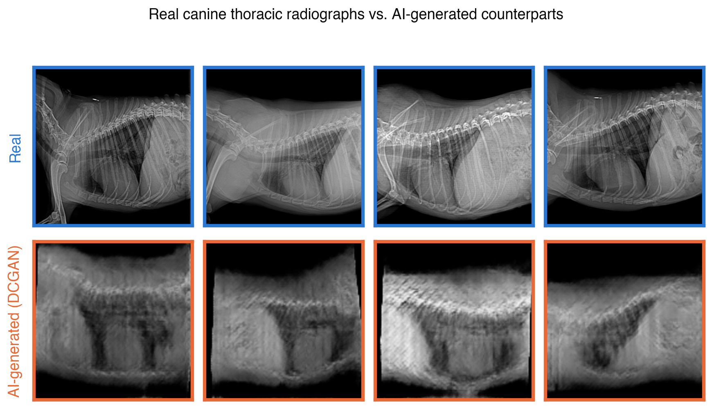
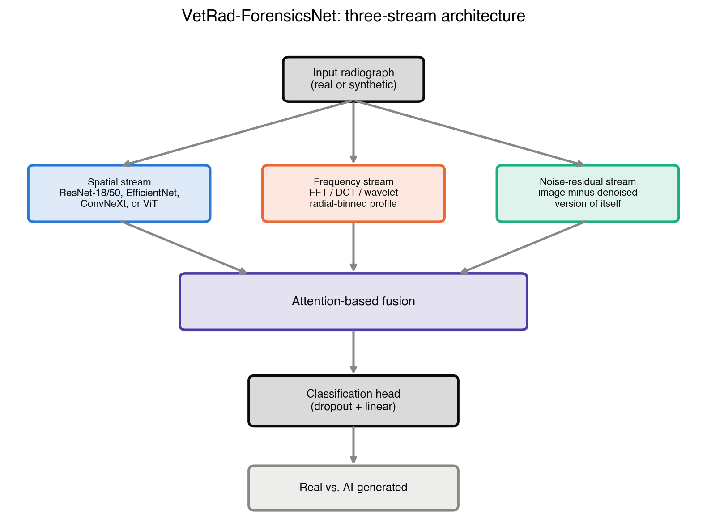

# VetScanForensics

**Detecting AI-Generated Veterinary Radiographs: A Benchmark, a Confound, and a Correction**

> **Research paper** — MSc in Artificial Intelligence, Universidad de La Salle, Bogotá, Colombia
> **Author:** Juan Manuel Castillo Pinto · jmmana@gmail.com
> **Paper:** [`paper/main.tex`](paper/main.tex) (IEEEtran, journal format) · compiled PDF: [`paper/paper_compiled_from_overleaf.pdf`](paper/paper_compiled_from_overleaf.pdf)
> **Dataset (Kaggle, real+synthetic, DCGAN baseline):** https://www.kaggle.com/datasets/maktub83/vet-radiographs-real-vs-ai-generated
> **Dataset (Kaggle, real-only generator training pool):** https://www.kaggle.com/datasets/maktub83/vet-radiographs-genpool-122
> **Repository:** https://github.com/jmmana/VetScanForensics

---

## What this is

Generative models (GANs, diffusion) can now synthesize medical images realistic enough to fool both automated systems and human experts — a risk confirmed for **human** chest radiographs by a March 2026 *Radiology* study (Tordjman et al., DOI: [10.1148/radiol.252094](https://doi.org/10.1148/radiol.252094)), where board-certified radiologists across 12 institutions and six countries missed a meaningful fraction of AI-generated X-rays. The same study explicitly names insurance fraud as a realistic misuse scenario.

No equivalent work exists for **veterinary** diagnostic imaging, despite pet insurance claims fraud being a real, costly, and documented problem for the industry (estimated 3–7 points of loss ratio, USD 300K–700K per USD 10M in written premium). This project builds, from the ground up, a dataset and detector for distinguishing real veterinary radiographs from AI-generated or AI-manipulated ones, and — just as importantly — audits its own results for the kind of methodological shortcuts that quietly inflate benchmarks in this field.

### Real vs. AI-generated: what we're actually working with

<p align="center">
  
</p>

Real canine thoracic radiographs (top, from the Mendeley VHS collection) versus radiographs generated by our baseline DCGAN (bottom). The visual gap is itself informative: a generator this far from photorealism should not need frequency-domain forensics to be caught — which is exactly why we did not trust our own first "100% accuracy" result at face value (see [Honest audit findings](#honest-audit-findings-read-this-first) below).

---

## Honest audit findings (read this first)

This project went through an internal audit that found and reported a real methodological problem in its own first version, rather than quietly fixing it and moving on. If you only read one section, read this one.

**Finding 1 — a resolution-history confound can produce a spuriously perfect detector.**
The initial proof-of-concept detector reached 100% accuracy/AUC. We audited why. Real images are downsampled from large, heterogeneous native scan resolutions (1480×844 up to 2756×2800 px); DCGAN outputs are natively 128×128 (built via transposed-convolution upsampling from a random seed). We proved this asymmetry alone — with **zero** generated images involved — is enough to reach AUC = 1.000: a detector trained to distinguish two groups of images that are **both 100% real**, differing only in resize history (direct downsample vs. reconstructed from an 8×8 seed, mimicking how a GAN builds an image), separates them perfectly. See `training/00_resolution_confound_test.py` and Figure `exp00_confound_examples.png`.

**Finding 2 — our first attempted fix did not work, and we said so.**
We implemented a shared, randomized resize augmentation applied identically to real and synthetic images, intended to neutralize Finding 1. Re-auditing with the fix applied still gave AUC = 1.000 — unchanged. We report this as a negative result (see `training/13_shortcut_audit.py`, `training/protocol_logs/README.md`) instead of tuning the fix until the audit passed. The likely cause: the fix's resize range (16–128 px) is less destructive than the 8×8 bottleneck it was meant to counteract, so it cannot retroactively erase a more extreme information loss.

**What this means for every number in this repo:** any single-generator (DCGAN-only) accuracy figure should be read as an *upper bound*, not confound-free forensic evidence. The test that actually matters is **cross-generator generalization** (does a signal trained on DCGAN transfer to StyleGAN2-ADA and diffusion-generated images, architectures with entirely different upsampling mechanics?) — that experiment is in progress (see [Current status](#current-status)).

We are documenting this prominently, in the paper and here, because a benchmark that cannot catch its own shortcuts is not a benchmark.

---

## Datasets

| Dataset | Images | Species/region | License | Used for |
|---|---|---|---|---|
| Mendeley VHS (Flores Dueñas et al.) | 152–156, canine thoracic lateral | UABC, Mexico | CC BY 4.0 | Real-image baseline |
| **VetXRay** (Banzato et al.) | 9,882, canine & feline thoracic | Univ. of Padua, Italy | CC BY 4.0 | Real-image expansion (identified and legally verified in this project) |

Both licenses were verified programmatically against the platform's own API (Mendeley Data public API, Zenodo record API: `"license": {"id": "cc-by-4.0"}, "access_right": "open"`), not assumed from a webpage or a third-party aggregator, after one independent inquiry incorrectly reported VetXRay's license as unconfirmed.

We surveyed the wider landscape (Zenodo, Mendeley, Figshare, Kaggle, IEEE DataPort, TCIA, institutional repositories, and ~20 veterinary-radiology ML papers) and found these two datasets to be the **only** veterinary radiograph collections with an unambiguous, redistribution-permitting open license. Everything else we found (University of Padua's other datasets, Ontario Veterinary College, VetAgro Sup, DogHeart/Dog-Cardiomegaly) is private, request-only, or has unresolved/contradictory licensing — see Table I in the paper for the full landscape, including why each one was excluded.

## Synthetic radiograph generation: three generator families

1. **DCGAN** (Radford et al., 2015) — already trained locally (Apple M4 Pro, MPS), the baseline used for all audit findings above.
2. **StyleGAN2-ADA** (Karras et al., NeurIPS 2020) — NVIDIA's adaptive discriminator augmentation method, designed specifically for GAN training in the low-data regime this project's real-image pool occupies. Training on Kaggle Notebooks (free GPU tier).
3. **Diffusion (DDPM)** — trained from scratch on the same real-image pool (not a fine-tuned Stable Diffusion checkpoint: a generic pretrained diffusion prior does not know radiographic anatomy and would complicate more than it helps). Also training on Kaggle.

## Detector architecture: VetRad-ForensicsNet

<p align="center">
  
</p>

Three complementary streams — spatial (CNN backbone), frequency (FFT/DCT/wavelet radial profile), and noise-residual — fused via attention before a classification head. The frequency ablation (spatial-only, FFT-only, DCT-only, wavelet-only, fused) already has real pilot results; see [Current status](#current-status).

---

## Repository structure

```
VetScanForensics/
├── data/
│   ├── raw/                    # manually downloaded Mendeley zip (gitignored)
│   ├── real/                   # 152 real radiographs, prepared
│   ├── fake/                   # DCGAN-generated radiographs
│   └── splits/real_split.json  # gen_pool (122) / holdout (30) split, seed 42
├── training/
│   ├── 00_resolution_confound_test.py   # EXP-00: proves the confound (see audit findings)
│   ├── 01_prepare_real_data.py          # downloads/organizes the Mendeley source data
│   ├── 01b_split_holdout.py             # EXP-01: creates the generator-level holdout split
│   ├── 02_train_generator_and_make_fakes.py  # DCGAN training + sampling
│   ├── 03_train_and_evaluate_detector.py     # EXP-02: dual-stream detector, corrected protocol
│   ├── 04_frequency_analysis_figure.py       # real-vs-fake average frequency spectrum figure
│   ├── 05_generate_more_fakes.py             # bulk-sample more fakes without retraining
│   ├── 06_cross_generator_matrix.py          # EXP-06: train-generator × test-generator matrix
│   ├── 07_baseline_architectures.py          # EXP-07: ResNet18/50, EfficientNet, ConvNeXt, ViT
│   ├── 08_frequency_ablation.py              # EXP-08: spatial/FFT/DCT/wavelet ablation
│   ├── 13_shortcut_audit.py                  # EXP-13: audits whether a mitigation actually works
│   ├── experiment_common.py                  # shared protocol code for 06/07/08 (reuses 03)
│   ├── preprocessing_common.py               # shared resize-round-trip mitigation logic
│   ├── GENERATORS.md                         # convention for adding new generator output folders
│   ├── make_real_vs_fake_figure.py           # the top-of-README comparison figure
│   ├── make_exp00_figure.py                  # the confound-evidence figure
│   ├── make_architecture_diagram.py          # the VetRad-ForensicsNet diagram
│   ├── metrics.json / metrics_old_protocol.json  # detector results, corrected vs. original
│   ├── exp0678_notas.md                      # detailed notes on EXP-06/07/08 pilot runs
│   ├── protocol_logs/README.md               # detailed notes on EXP-01/02/13
│   └── exp{00,06,07,08,13,15}_*/             # raw JSON/CSV result files per experiment
├── kaggle_kernels/
│   ├── exp03_stylegan2ada/     # Kaggle kernel: StyleGAN2-ADA training
│   ├── exp04_diffusion/        # Kaggle kernel: DDPM training from scratch
│   └── diag/                   # minimal diagnostic kernel (used to debug a Kaggle mount-path issue)
├── kaggle/                     # packaging + upload script for the public Kaggle dataset
├── specs/                      # detailed specs used to delegate implementation work to Codex CLI,
│                                 with independent validation notes for each
├── paper/
│   ├── main.tex                # the paper itself (IEEEtran, journal format, ~30-section structure)
│   ├── figures/                # all real figures (see below)
│   └── paper_compiled_from_overleaf.pdf
└── requirements.txt
```

## Pipeline: step by step

```bash
python3 -m venv .venv && source .venv/bin/activate
pip install -r requirements.txt

# 1. One-time manual download (Mendeley serves the real file via JavaScript,
#    there is no stable REST endpoint to automate this step):
#    open https://data.mendeley.com/datasets/ktx4cj55pn/1
#    click "Download all 152 files", move the zip to data/raw/
python training/01_prepare_real_data.py

# 2. Create the generator-level holdout split (never shown to any generator)
python training/01b_split_holdout.py

# 3. Train the DCGAN baseline and sample synthetic radiographs
python training/02_train_generator_and_make_fakes.py --epochs 800 --split-file data/splits/real_split.json

# 4. Train and evaluate the dual-stream detector under the corrected protocol
python training/03_train_and_evaluate_detector.py --epochs 25 --split-file data/splits/real_split.json

# 5. Regenerate the frequency-spectrum and confound figures
python training/04_frequency_analysis_figure.py
python training/00_resolution_confound_test.py
python training/13_shortcut_audit.py

# 6. Cross-generator matrix, architecture baselines, frequency ablation
python training/06_cross_generator_matrix.py --epochs 25
python training/07_baseline_architectures.py --backbone resnet18 --epochs 25
python training/08_frequency_ablation.py --features all --epochs 25

# 7. StyleGAN2-ADA and diffusion training (Kaggle, GPU) — see kaggle_kernels/
kaggle kernels push -p kaggle_kernels/exp03_stylegan2ada
kaggle kernels push -p kaggle_kernels/exp04_diffusion

# 8. Publish the dataset (real + all synthetic) to Kaggle
bash kaggle/upload.sh
```

Run the test suite for the shared experiment code before trusting a new environment:

```bash
cd training && python3 -m unittest test_exp0678 -v
```

---

## Current status

This is a living research project, not a finished paper. Honest status as of the latest commit:

| Phase | Status |
|---|---|
| EXP-00: confound diagnosis | ✅ Done — confirmed empirically (AUC 1.000) |
| EXP-01: generator-level holdout split | ✅ Done — 122 gen_pool / 30 holdout, seed 42 |
| EXP-02: corrected-protocol detector | ✅ Done — 95.5% accuracy (was 100%) |
| EXP-13: shortcut mitigation audit | ⚠️ Done, negative result — mitigation did not neutralize the confound |
| EXP-03: StyleGAN2-ADA training | 🔄 In progress (Kaggle GPU) |
| EXP-04: diffusion training | 🔄 In progress (Kaggle GPU) |
| EXP-06: cross-generator matrix | 🟡 Pipeline verified (1×1, DCGAN only); 3×3 pending EXP-03/04 |
| EXP-07: architecture baselines | 🟡 ResNet-18 pilot done (97.8% acc, 2-epoch verification); 4 more backbones implemented, not yet trained |
| EXP-08: frequency ablation | 🟡 Pilot complete for all 5 variants (DCGAN, 2 epochs); full 25-epoch/3-generator run pending |
| EXP-09–EXP-23 (robustness, open-set, explainability, attribution, statistics, failure analysis) | ⬜ Not started — implemented as clearly marked pending sections in the paper, no fabricated numbers |
| EXP-18: human Visual Turing Test | ⬜ Designed only, deliberately **not executed** (requires IRB/ethics approval and informed consent we have not pursued) |

No number in the paper is invented. Sections that depend on experiments not yet run are marked `[EXPERIMENT REQUIRED]` in the LaTeX source rather than filled with placeholder or estimated values.

---

## Figures already in the paper

- `real_vs_fake_examples.png` — real vs. DCGAN-generated radiographs (shown above).
- `exp00_confound_examples.png` — visual evidence for the resolution-history confound (two groups, both 100% real).
- `confusion_matrix.png` — corrected-protocol detector confusion matrix.
- `roc_curve.png` — corrected-protocol ROC curve.
- `frequency_spectrum_comparison.png` — average log-power spectrum, real vs. synthetic.
- `architecture_diagram.png` — VetRad-ForensicsNet three-stream architecture.

All use a validated, colorblind-safe categorical palette (blue for real, orange for synthetic, consistent across figures).

---

## Honest limitations

- With ~10,000 combined real images (Mendeley + VetXRay) this is far larger than the original 152-image proof of concept, but still modest relative to human-imaging forensics benchmarks like MedForensics.
- The resolution-history confound (see above) is **not confirmed neutralized**. Every DCGAN-only number in this repository should be read with that caveat until cross-generator results are in.
- The real datasets cover thoracic radiographs only (canine + feline). Other views (orthopedic, abdominal) and modalities (ultrasound) are out of scope for now.
- This is a research contribution and an openly available dataset to seed further study, **not** a deployed fraud-detection product. See the paper's Threat Model and Insurance-Fraud Deployment Scenario sections for the intended (human-in-the-loop, triage-only) use.

## Key citations

See `paper/main.tex` for the full, individually-verified bibliography (34 entries, each checked against a primary source — DOI/Crossref, arXiv, PubMed, or the publisher — before inclusion). Highlights:

- Tordjman et al., "The Rise of Deepfake Medical Imaging," *Radiology* 318(3):e252094, 2026. DOI: [10.1148/radiol.252094](https://doi.org/10.1148/radiol.252094)
- Li et al., "Toward Medical Deepfake Detection" (MedForensics/DSKI), MICCAI 2025. arXiv:2509.15711
- Karras et al., "Training Generative Adversarial Networks with Limited Data" (StyleGAN2-ADA), NeurIPS 2020. arXiv:2006.06676
- Banzato et al., "VetXRay," Zenodo, DOI: [10.5281/zenodo.19051776](https://doi.org/10.5281/zenodo.19051776)
- Flores Dueñas et al., "Radiographic Dataset for VHS Determination Learning Process," Mendeley Data, DOI: [10.17632/ktx4cj55pn.1](https://doi.org/10.17632/ktx4cj55pn.1)
